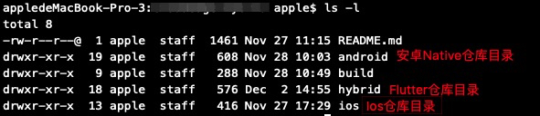
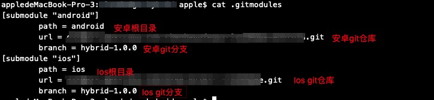

[TOC]
#  **Flutter混合开发**
## **1. 为什么我们要用Flutter做混合开发？**

* 目前Native的原生开发，做到后面对团队的要求越来越高，android和ios两方的代码逻辑独立，需要转向维护，对于小公司而言，如果能够合力开发，那么就可以将逻辑做到统一，较少维护和开发成本。
* 使用Flutter的原因是，Flutter支持ios和android开发，同时背靠google，成功的机率很高，目前它是混合开发里面关注度比较多的一种语言。
* 它使用dart开发，相对容易入门
* 后面flutter应用可以扩展到桌面和web程序


## **2. Flutter会污染Native的工程，怎么解决？**

按照应用场景，做两种模式
- **调试模式**

  当我们内部做调试时，为了快速的调试flutter的代码，我们以源码的形式加载到原生工程中
- **第三方库加载**

  提供第三方对接使用，客户没有flutter环境
  我们将涉及到的flutter和原生代码上传到服务器。
  - Android打包成aar-》上传Maven服务器
  - Ios通过cocopod管理，上传到oss-》客户通过pod管理下载oss的framework


## **3. 源码加载Flutter**
### **3.1 git管理子工程**
1）**创建android目录-Android仓库目录**
```bash
  $mkdir -p android
```

2）**创建ios目录-Ios仓库目录**
```bash
  $mkdir -p ios
```

3）**创建hybrid目录-flutter仓库**
```bash
  $flutter create -t module --org com.meari hybrid
```
**可以看到当前目录如下图**:



4）**创建git子项目**
```bash
  $git submodule add 安卓仓库地址 android
  $git submodule add Ios仓库地址 ios
```
**可以看到当前目录如下图**:



5）**导入子项目**
```bash
  $git submodule init
  $git submodule update
```
### **3.2 Android加载Flutter**
1）**进入hybrid目录，初始化flutter项目**
```bash
  第一次使用请输入($flutter upgrade),防止编译不过
  $flutter pub get
```

2）**修改android目录下，app文件夹中的build.gradle**
```gradle
android {
  compileOptions {
    sourceCompatibility 1.8
    targetCompatibility 1.8
  }
}
```

3）**修改android目录下的setting.gradle**
```gradle
include ':app'
setBinding(new Binding([gradle: this]))    
evaluate(new File(  
  settingsDir.parentFile, 
  'my_flutter/.android/include_flutter.groovy'  
)) 
```

4）**修改android目录下，app文件夹中的build.gradle**
```gradle
dependencies {
  implementation project(':flutter')
}
```

5）**使用Android studio打开android目录主工程编译或者命令行编译**
```gradle
  $gradlew assembleRelease
```

### **3.3 Ios加载Flutter**
1）**进入hybrid目录，初始化flutter项目**

  第一次使用请输入($flutter upgrade),防止编译不过
```flutter
  $flutter pub get
```
2）**进入ios目录，修改Podfile文件**

在target中加入如下代码
```swift
flutter_application_path = '../hybrid/'
load File.join(flutter_application_path, '.ios', 'Flutter', 'podhelper.rb')
install_all_flutter_pods(flutter_application_path)
```
3）**进入ios目录，运行如下命令**
```shell
  $pod install
```

4）进入ios目录，打开xcode，直接进行编译

### **3.4 Android Maven加载Flutter**

  TODO
### **3.5 Ios Cocopods加载Flutter**

  TODO
## **4 原生和Flutter通信**
### **4.1 Android通信**
1）**java层定义命令行通道**
```java
  定义命令通道 
  private static final String BATTERY_CHANNEL = "com.pages.your/native_get";
  private static final String CHARGING_CHANNEL = "com.pages.your/native_post";
```
2）**创建java层命令行通道**
```java
 new EventChannel(flutterEngine.getDartExecutor(), CHARGING_CHANNEL).setStreamHandler(
        new StreamHandler() {
            @Override
            public void onListen(Object arguments, EventSink events) {
                
            }

            @Override
            public void onCancel(Object arguments) {
            }
        }
);
new MethodChannel(flutterEngine.getDartExecutor(), BATTERY_CHANNEL).setMethodCallHandler(
        new MethodCallHandler() {
            @Override
            public void onMethodCall(MethodCall call, Result result) {
            }
        }
);
```
3）**flutter定义命令行通道**
```dart
static const methodChannel = const MethodChannel('com.pages.your/native_get');
static const EventChannel eventChannel = const EventChannel('com.pages.your/native_post');
```
4）**flutter创建命令行通道**
```dart
eventChannel.receiveBroadcastStream(12345).listen(_onEvent,onError: _onError);
// 回调事件
void _onEvent(Object event) {
}
// 错误返回
void _onError(Object error) {
}

_iOSPushToVC1() async {
  Map<String, dynamic> map = {"code": "200", "data":[1,2,3]};
  await methodChannel.invokeMethod('iOSFlutter1', map);
}
```

### **4.2 Ios通信**
1）**flutter定义命令行通道**
```swift
NSString *channelName = @"com.pages.your/native_get";
FlutterEventChannel* chargingChannel = [FlutterEventChannel eventChannelWithName:@"com.pages.your/native_post"
```
2）**flutter创建命令行通道**
```swift
FlutterViewController* flutterViewController = [[FlutterViewController alloc] initWithProject:nil nibName:nil bundle:nil];
[messageChannel setMethodCallHandler:^(FlutterMethodCall * _Nonnull call, FlutterResult  _Nonnull result) {
}];
- (FlutterError*)onListenWithArguments:(id)arguments
                             eventSink:(FlutterEventSink)eventSink {
  return nil;
}
- (FlutterError*)onCancelWithArguments:(id)arguments {
  return nil;
}
FlutterMethodChannel *messageChannel = [FlutterMethodChannel methodChannelWithName:channelName binaryMessenger:flutterViewController];
[chargingChannel setStreamHandler:self];
```

3）**修改WYAppDelegate.h**
```swift
#import <Flutter/Flutter.h>
@interface WYAppDelegate : FlutterAppDelegate <UIApplicationDelegate, FlutterAppLifeCycleProvider>
@end
```
4）**修改WYAppDelegate.m**
```swift
@implementation WYAppDelegate
FlutterPluginAppLifeCycleDelegate *_lifeCycleDelegate;
- (instancetype)init {
    if (self = [super init]) {
        _lifeCycleDelegate = [[FlutterPluginAppLifeCycleDelegate alloc] init];
    }
    return self;
}
- (BOOL)application:(UIApplication *)application didFinishLaunchingWithOptions:(NSDictionary *)launchOptions {
    return [_lifeCycleDelegate application:application didFinishLaunchingWithOptions:launchOptions];
}
@end
```

### **4.3 跳转指定页面路由**
1）**Android跳转指定页面路由**
```java
Intent fluttermyAppIntent = new Intent(mainActivity, SmartFlutter.class);
fluttermyAppIntent.setAction(Intent.ACTION_RUN);
fluttermyAppIntent.putExtra("initial_route","myApp");
mainActivity.startActivity(fluttermyAppIntent);
```

2）**Ios跳转指定页面路由**
```swift
[flutterViewController setInitialRoute:"myApp"];
```

## **4. pubspec.yaml详解**
```yaml
name: hybrid #根目录
description: A new flutter module project. #描述
version: 1.0.0+1
environment:
  sdk: ">=2.2.2 <3.0.0"
dependencies:
  flutter:
    sdk: flutter
  #各种依赖包
dev_dependencies:
  flutter_test:
    sdk: flutter
  #各种依赖包
flutter:
  uses-material-design: true
  assets:
    - lib/gallery/example_code.dart
    - packages/flutter_gallery_assets/people/ali_landscape.png
  fonts:
    - family: Raleway
      fonts:
        - asset: packages/flutter_gallery_assets/fonts/raleway/Raleway-Regular.ttf
        - asset: packages/flutter_gallery_assets/fonts/raleway/Raleway-Medium.ttf
          weight: 500
        - asset: packages/flutter_gallery_assets/fonts/raleway/Raleway-SemiBold.ttf
          weight: 600
  module:
    androidX: true
    androidPackage: com.cloudedge.hybrid
    iosBundleIdentifier: com.cloudedge.hybrid
```

## **5 Flutter国际化**
[国际化](https://flutter.cn/docs/development/accessibility-and-localization/internationalization)

## **6 Dart 互调C和C++**
[Dart 互调C和C++](https://flutter.cn/docs/development/platform-integration/c-interop)

## **插件开发**
[使用插件](https://flutter.cn/docs/development/packages-and-plugins/using-packages)
[开发插件](https://flutter.cn/docs/development/packages-and-plugins/developing-packages)

## **参考资料**
- [flutter插件仓库](https://pub.flutter-io.cn/packages/)
- [flutter集成到原生工程](https://github.com/flutter/flutter/wiki/Add-Flutter-to-existing-apps)
- [flutter中文网站](https://flutter.cn/)


